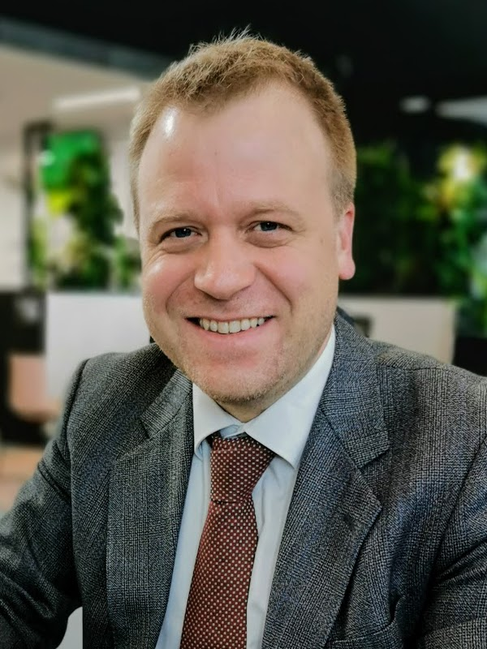
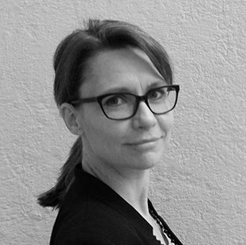
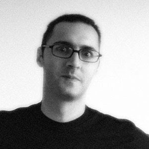
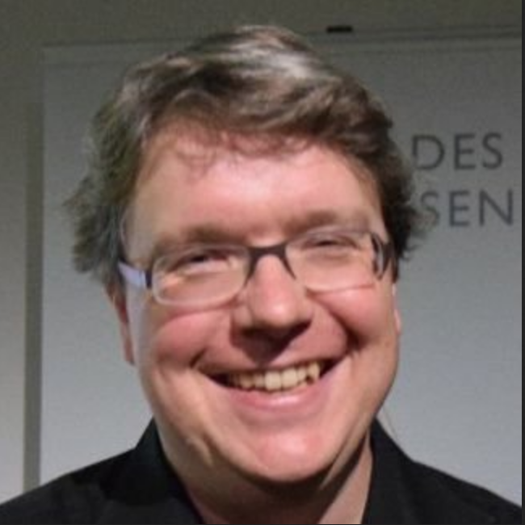
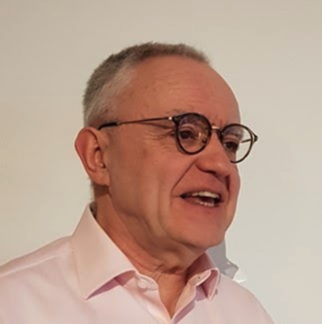

# ISCC Foundation Board

## Board of Directors

=== "Sebastian Posth"

```
{: width=180 align=left }

**CEO of Posth Werk BV, Chairman of the Board of the ISCC Foundation**

Sebastian is an entrepreneur and consultant in the media industries with a focus on digital innovation and decentralized ledger technology. *(Photo: [Private](https://posth.me/about-me/))*

https://www.linkedin.com/in/posth/
```

<hr>

=== "Kira Lemke"

```
{: width=180 align=left }

**Treasurer ISCC Foundation, COO Craft AG**

Kira is co-founder and COO of Craft AG. She is a specialist for business development and financial development for new business models and monetization strategies.

https://www.linkedin.com/in/kiralemke
```

<hr>

=== "Titusz Pan"

```
{: width=180 align=left }

**Director ISCC Foundation, CEO Craft AG**

Titusz Pan is an entrepreneur and open-source developer. He is the inventor and architect of the ISCC. As co-founder and CEO of Craft AG, he has been developing media technology projects and incubations since the year 2000.

https://www.linkedin.com/in/titusz/
```

<hr>

## Advisory Board

=== "Roanie Levy"

```
{: width=180 align=left }

**Access Copyright, The Canadian Copyright Licensing Agency**

An internationally recognized champion of creator rights, Roanie Levy is the CEO of Access Copyright, a collective that distributes millions of dollars annually in licensing royalties to creator and publisher affiliates in Canada, and also leads Prescient Innovations, Access Copyright’s innovation lab, which seeks to change the compensation paradigm for creators. Roanie bridges the worlds of intellectual property law, content rights management and exponential technologies together to represent and advocate for creators and rightsholders. (Photo by Jennifer Rowsom)

 https://www.linkedin.com/in/roanie-levy-255299a/
```

<hr>

=== "Lambert Heller"

```
{: width=180 align=left }

**TIB – Leibniz Information Centre for Science and Technology**

In 2013 Lambert founded the Open Science Lab at TIB, in Hannover, Germany. The lab runs a number of national and international grant projects, focussing mostly on the development of open research infrastructures (e.g. researcher profile systems based on linked open data), and creative use cases for digital collections in libraries, archives and museums, e.g. through hackathons. *(Photo: Lilli Iliev (WMDE) / CC BY-SA)*

https://twitter.com/Lambo<br>
https://tib.eu/Lambo
```

<hr>

=== "Philippe Rixhon"

```
{: width=180 align=left }

**Industry Associate, Centre for Blockchain Technologies, University College London**

Philippe Rixhon is a systems and policy engineer working on value flows in content ecosystems and the holistic implementation of copyright law. He is currently blueprinting Electronic Markets for Media Assets and their underlying rights register. *(Photo: Private)*

https://www.linkedin.com/in/philipperixhon/
```
