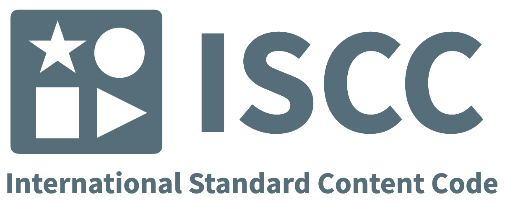

title: About the ISCC
description: About the International Standard Content Code

# About the ISCC

With the emergence of blockchain technology the Internet is moving towards a network of peer-to-peer transactions. An increasing amount of dynamic, short-lived and granular content needs to be managed and require new and innovative tools.

Distributing, licensing and re/selling digital content on a global scale is often an all too complicated and inefficient process. Identifiers are randomly and ambiguously applied to content files, metadata or license terms are often incoherent and loosely attached to the content, distributed in separate (ONIX) files, or subject to individual legal negotiations – all of this is time-consuming and prone to errors and manual interventions.

Freely accessible standard identifiers, which are specifically designed to manage digital content, are a fundamental prerequisite for efficient transactions in a decentralized and increasingly heterogeneous media environment. The **ISCC (International Standard Content Code)** is the first open, generic identifier designed for digital media content. It can be used to register content on the blockchain and also in off-chain environments.

## Standardization

The ISCC will be even more useful the more users agree on the suggested standard procedure of hashing the content in order to create the content’s unique ID. The ISCC currently is a new work item proposal at the proposal stage at [ISO/TC 46/SC 9](https://iso.org/committee/48836.html).

## Specification

See ISCC Specification at: <https://iscc.codes>

