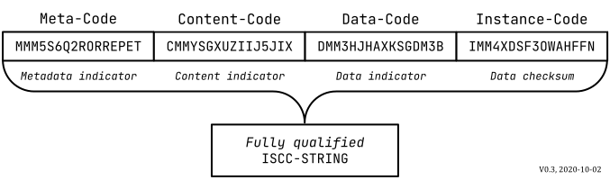

---
hide:
  - navigation
title: About the ISCC
description: About the International Standard Content Code
---

# About the ISCC

!!! note "ISCC has a new Website"

    This website is deprecated! We leave it running for historic reasins but it is not updated.

    ## **Please visit our new site at [iscc.io](https://iscc.io)**

The need for a *universal identifier* for *digital content* has emerged as an increasing amount of
dynamic, short-lived and granular *digital content* is produced, consumed and processed. Commercial
interests of many stakeholders depend on proper identification of *digital content*.

Professionally produced *digital content* but also semi-professional and user-generated *content*
are the currency of the information age.

A variety of specific *content identifier* standards already exist, but a universal
*content-dependent identifier* for *digital assets* has not yet been developed.

In particular, the structure and management of *identifiers* for *digital content* have a
substantial impact on the level of possible adoption, automation, and the potential for
machine-to-machine communication and innovation within and across different industry sectors.

*Digital content* is dynamic, always in motion, and acted upon globally by a variety of entities
with different interests and requirements. *Digital content* continuously re-encodes, resizes, and
re-compresses, changing its underlying *data* as it travels through a complex network of *actors*
and systems.

**The International Standard Content Code (ISCC)** is a proposal for universal *identifier* for
*digital assets* that encode text, images, audio, video or other *content.*

The ISCC is generated from the *digital content* itself. It is the result of processing the *digital
content* using a variety of *hash algorithms.* The generated code supports *data* integrity
verification and also preserves an estimate of the *data*, *digital content* and *metadata*
similarity. However, ISCC is not a replacement for a *content recognition system*.

The ISCC bridges the gap between higher-level *content identifiers* like work and product
*identifiers* and their relations to digitally encoded manifestations of *content*. Because the ISCC
is a *content-dependent identifier,* it does not necessarily require a registration authority. The
ISCC does not specify a system for managing authoritative *metadata*. Other *content identifier*
standards can use ISCC to support discoverability of their *identifiers* and *metadata* based on
*digital content*.

The ISCC enables interoperability at the level of the *digital asset* and supports scenarios that
require *content* deduplication, integrity verification, timestamping, versioning, *data*
provenance, fact-checking and general *digital asset* management use-cases at regional, national or
international scale.

## Standardization

The ISCC will be even more useful the more users agree on the suggested standard procedure of
hashing the content in order to create the content’s unique code. The ISCC has been accepted by ISO
as full work item **ISO/CD 24138.2 - International Standard Content Code** and is currently being
standardized at TC 46/SC 9/WG 18. https://www.iso.org/standard/77899.html

## Specification

See ISCC Specification at: <https://iscc.codes>
