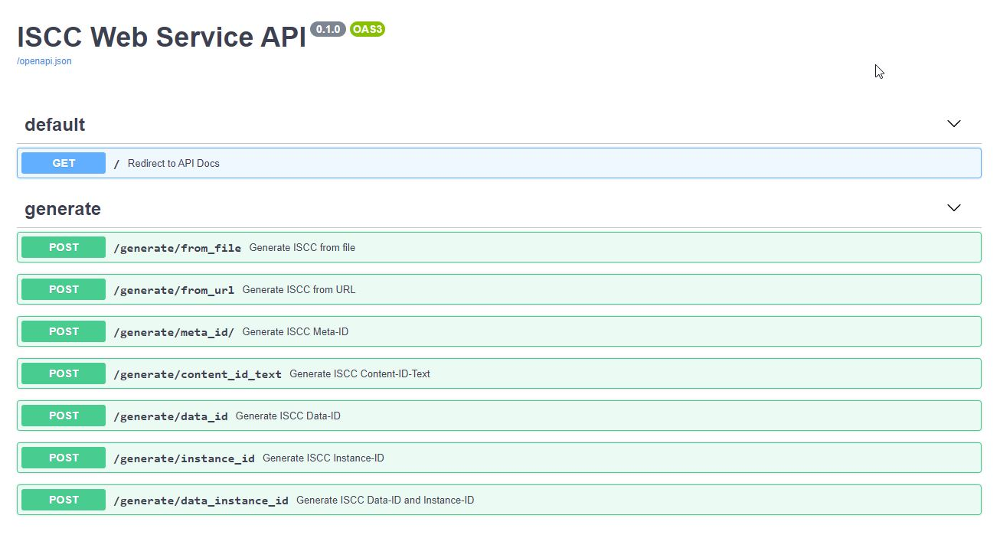
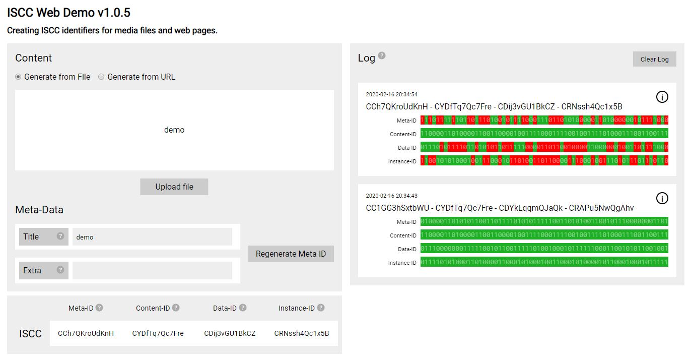

# ISCC - Year 2019 - Status Report

!!! note "ISCC has a new Website"

    This website is deprecated! We leave it running for historic reasins but it is not updated.

    ## **Please visit our new site at [iscc.io](https://iscc.io)**

After being accepted as PWI at the annual ISO meeting in May 2019 the ISCC initiators Sebastian
Posth, Kira Lemke and Titusz Pan have set up the [ISCC Foundation](https://iscc.foundation/) in the
Netherlands to coordinate and manage further development. Throughout the year 2019 activities have
focused on promoting adoption and advance the specifications and reference implementations.

## Promoting Adoption

The ISCC Foundation has actively introduced the **ISCC** in countless conversations and meetings
with stakeholders across different sectors of the content and media industries worldwide.

- Presentation at [Blockchain for Science](https://www.blockchainforscience.com/)

  <iframe width="1280" height="720" src="https://www.youtube.com/embed/4OCvPrDhGuQ" frameborder="0" allowfullscreen></iframe>

- Presentation at Verband Deutscher Zeitungsverleger (VDZ) -
  [Blockchain Tour](https://vdz-akademie.de/blockchain-tour/) (thanks for the donation.)

- Presentation at
  [The Publishing Fair 2019](https://www.thepublishingfair.it/en/sessioni/blockchain-in-publishing/),
  Torino, 24 November 2019

- Presentation at
  [IFFRO World Congress and Annual General Meeting 2019](https://www.ifrro2019edinburgh.com/),
  Edinburgh, 5 November 2019

- Presentation at
  [Frankfurt Rights Meeting 2019](https://www.buchmesse.de/en/visit/conferences/frankfurt-rights-meeting),
  Frankfurt am Main, 15 October 2019

- Presentation at [Jahrestagung IG Digital](https://www.igdigital.de/igd19/) (Boersenverein) during
  the Buchtage 2019, Berlin, 17-18 May 2019

- Presentation at
  [DPUB Summit Conference](https://www.edrlab.org/events/dpub-summit-2019/dps-speakers/#Sebastian_POSTH),
  Paris, 25-26 May 2019

  <iframe width="1280" height="720" src="https://www.youtube.com/embed/BNqWLlwKx5U" frameborder="0" allowfullscreen></iframe>

- Presentation at [Readmagine Conference](https://readmagine.org/miercoles-5-de-junio/), Madrid 4-6
  May 2019

## ISCC Development

ISCC development follows a dynamic and pragmatic approach. Implementation and testing come before
specification. We distinguish between the status of the implementation and the specification.

In 2019 we have created a new command-line toolkit that adds support for audio and video
identifiers. For the preliminary implementation of the Content-Code Video, we have decided to build
upon the [MPEG-7 ISO/IEC 15938 Standard](https://www.iso.org/standard/75399.html). We now have a
testable, end-to-end, open-source implementation of the initial proposal.

Interested parties are invited to test the ISCC with the provided command-line tool at
https://github.com/iscc/iscc-cli and provide feedback and feature requests at
https://github.com/iscc/iscc-cli/issues

### Main Implementation

The current main implementation is an
[open-source command-line tool](https://github.com/iscc/iscc-cli) that can be used on Windows, Linux
and Mac systems by developers and computer savvy persons (see: https://github.com/iscc/iscc-cli). In
the latest release it supports:

- Creation of ISCC codes for text, image, audio, video
- Content extraction and ISCC code creation directly from local media files
- Content extraction and ISCC code creation directly from HTTP remote media files
- Batch creation of ISCC codes for files in local folders (recursive)
- Pairwise similarity comparison of ISCC Codes

### ISCC Web Api Service

Based on the CLI tool we have also created an open-source
[web service API for creating ISCC codes](https://github.com/iscc/iscc-service) that can be
installed on-premises.

### ISCC Web Demo

The interactive [web demo](https://iscc.coblo.net/) for technical demonstrations has also been
updated to the new API backend. The [source code](https://github.com/coblo/iscc-demo) is also
available.

### ISCC Statistics

- Total Downloads of ISCC Specs & Reference [**12.340**](https://pepy.tech/project/iscc)
- Total Downloads of ISCC Command Line Tool [**13.852**](https://pepy.tech/project/iscc-cli)
- Number Registered ISCC Codes on COBLO testnet
  [**568.580**](https://explorer.coblo.net/stream/iscc)

### Status of Specification

The status of the public technical specification (https://iscc.codes/specification/) covers the
overall architecture and has detailed specifications including test data for conformance testing for
the following ISCC components:

- Meta-Code
- Content-Code Text
- Content-Code Image
- Content-Code Mixed
- Data-Code
- Instance-Code

Interested parties are invited to review and contribute to the specification and provide feedback
and feature requests at https://github.com/iscc/iscc-specs/issues.

## Roadmap

Next steps for the main implementation:

- ISCC Short-ID
- ISCC Code Indexing and nearest neighbor search
- ISCC Code Blockchain registration and querying

Next steps for the specification:

- Specs for Content-Code Audio
- Specs for Content-Code Video
- Specs for Short-ID
- Specs for blockchain registration

We are planning to implement blockchain registration in conformance with the
[DID system](https://www.w3.org/TR/did-core/). Currently, Titusz Pan is regularly working on the
main implementation and technical specifications. The ISCC Foundation recommends putting more eyes
and hands on testing, development, and specification.
